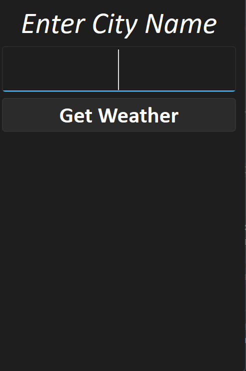
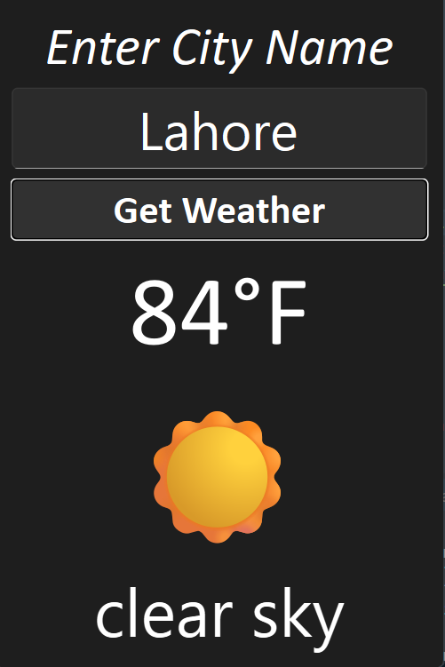
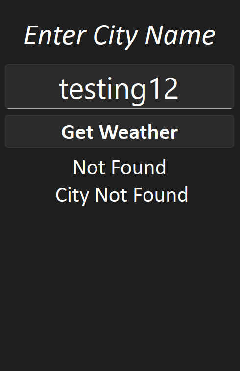

# Weather App 🌦️

A simple desktop weather application built with **PyQt6** and the **OpenWeatherMap API**. Enter any city name and instantly see the current temperature, a matching weather emoji, and a short description of the conditions.

## Screenshots


| Search | Result | Error |
|--------|--------|-------|
|  |  |  |
## Features

- 🔍 Search current weather by city name
- 🌡️ Temperature displayed in Fahrenheit
- 😀 Weather condition shown as an emoji, based on OpenWeatherMap's condition codes
- 📝 Short text description of current conditions (e.g. "light rain")
- ⚠️ Clear, user-facing error messages for common failure cases (invalid city, bad API key, server errors, connection issues, timeouts)    

## Tech Stack

| Tool | Purpose |
|------|---------|
| [Python 3.13](https://www.python.org/) | Language runtime |
| [PyQt6](https://pypi.org/project/PyQt6/) | Desktop GUI framework |
| [requests](https://pypi.org/project/requests/) | HTTP client for calling the weather API |
| [OpenWeatherMap API](https://openweathermap.org/api) | Weather data source |
| [uv](https://docs.astral.sh/uv/) | Project & dependency manager |

## Prerequisites

- Python 3.13 or newer
- [uv](https://docs.astral.sh/uv/getting-started/installation/) installed
- A free API key from [OpenWeatherMap](https://home.openweathermap.org/users/sign_up)

## Setup

Clone the repository and sync dependencies with `uv`:

```bash
git clone <https://github.com/omerkhanlhr/weather-app>
cd weather-app
uv sync
```

`uv sync` reads `pyproject.toml` / `uv.lock` and creates an isolated virtual environment with exactly the dependencies this project needs (PyQt6, requests).

## Configuration

This app needs an OpenWeatherMap API key. **Do not hardcode it in the source file** — set it as an environment variable instead:

macOS / Linux:
```bash
export OPENWEATHER_API_KEY="your_api_key_here"
```

Windows (PowerShell):
```powershell
$env:OPENWEATHER_API_KEY="your_api_key_here"
```

The app reads this value with `os.environ["OPENWEATHER_API_KEY"]` (or via a `.env` file with `python-dotenv`) instead of a literal string in the code.

> ⚠️ **Security note:** if an API key was ever committed to source control, treat it as compromised — regenerate it from your OpenWeatherMap dashboard and update your environment variable.

## Running the App

```bash
uv run python main.py
```

`uv run` executes the command inside the project's managed virtual environment, so you don't need to manually activate it first.

## How It Works

1. The GUI is built with PyQt6 widgets: `QLineEdit` for the city input, `QPushButton` to trigger the search, and `QLabel`s to display the result.
2. On button click, `requests.get()` calls the OpenWeatherMap `/weather` endpoint for the entered city.
3. The response is parsed as JSON; temperature (returned in Kelvin) is converted to Fahrenheit.
4. The weather's numeric condition code is mapped to an emoji.
5. HTTP and network errors are caught with specific `requests.exceptions` classes and shown to the user as friendly messages, instead of raw stack traces.

## Project Structure

```text
weather-app/
├── pyproject.toml
├── uv.lock
├── README.md
└── main.py
```

This is intentionally a single-file project for now. As it grows (tests, multiple screens, packaging), it can be reorganized into a `src/` layout.

## License

MIT — feel free to use this project as a learning reference.